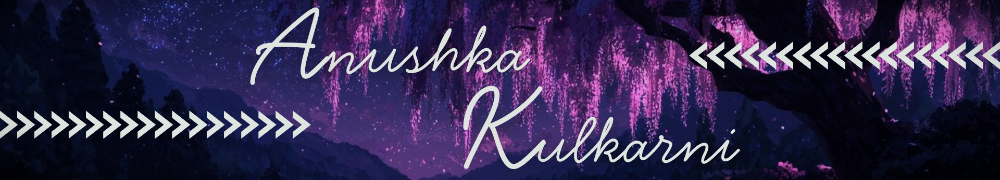

<!-- HEADER BANNER -->

<!-- TYPING SVG -->

 

 

<!-- ABOUT SECTION -->
## 🪐 About Me

<picture>
  <source media="(prefers-color-scheme: dark)" srcset="assets/dark.svg">
  
  
</picture>

Hi! I'm a passionate **Computer Science student** in my 3rd year, minoring in **Generative AI**.
I'm driven by high standards and a strong work ethic, always aiming to deliver more than expected and push the boundaries of what I build.

- 🔭 Currently deepening my skills in **Generative AI & applied ML**
- 🌱 Always learning — new frameworks, new systems, new ideas
- ⚡ Believe in shipping quality over shortcuts
- 💬 Ask me about Python, PyTorch, or backend systems
- 📫 Reach me via the contact section below

 

---

<!-- TECH STACK -->
## 🛠️ Tech Stack

                    

---

<!-- GITHUB STATS + STREAK -->
## 📊 GitHub Stats

 
 

---

<!-- ACTIVITY GRAPH -->
## 📈 Contribution Activity

<!-- 

 -->

---

<!-- SNAKE CONTRIBUTION ANIMATION -->
## 🐍 Contribution Snake

---
### ✍️ Dev Quote

<!-- CONTACT -->
## 📬 Contact Me

---

<!-- FOOTER -->

✨ Thanks for stopping by — always building, always learning. ✨

